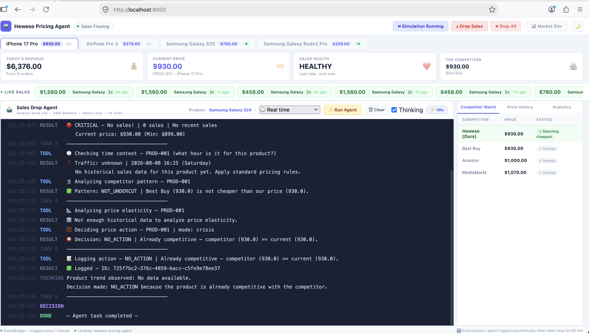
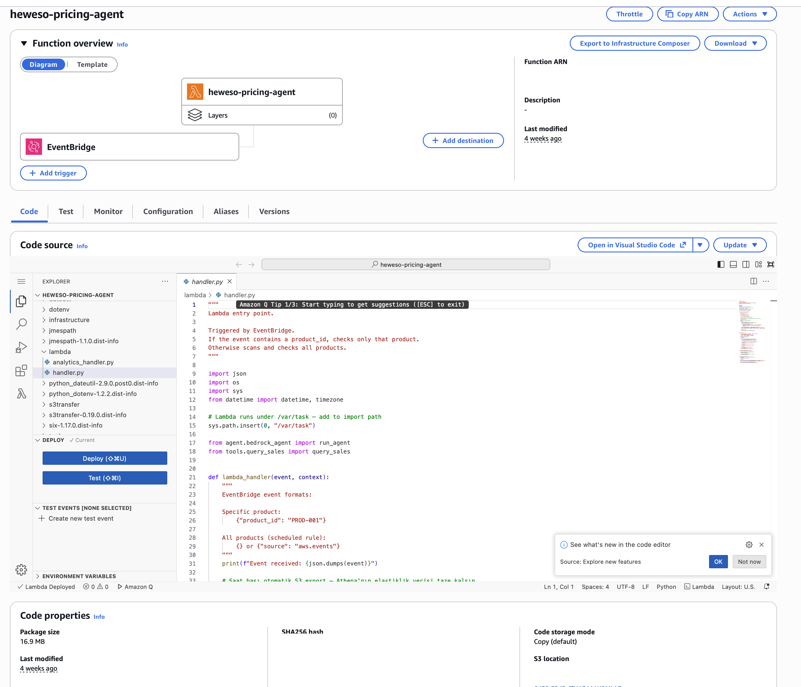
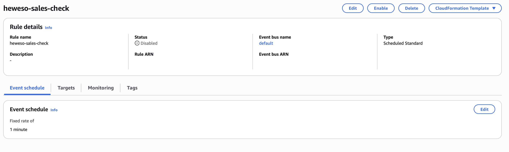
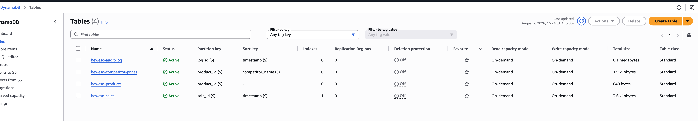
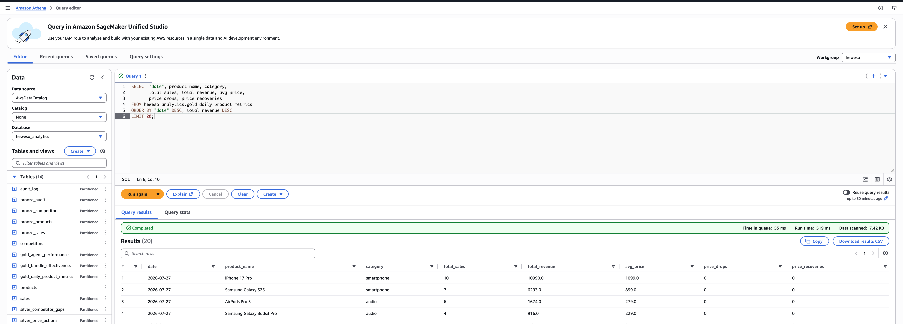
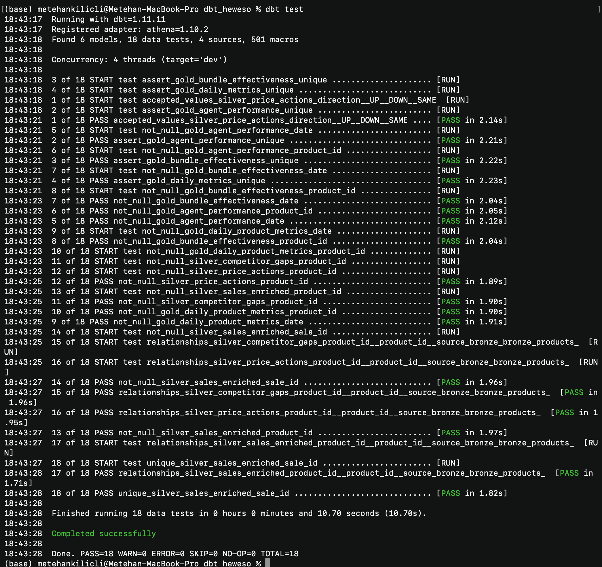
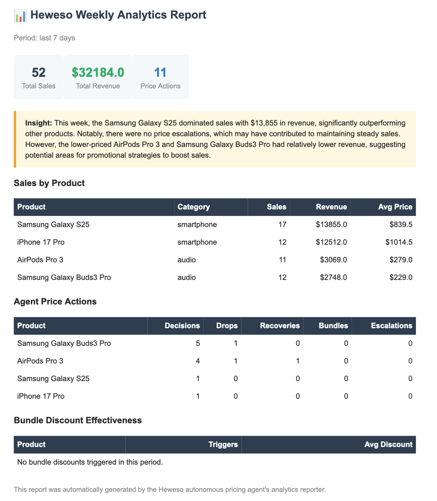
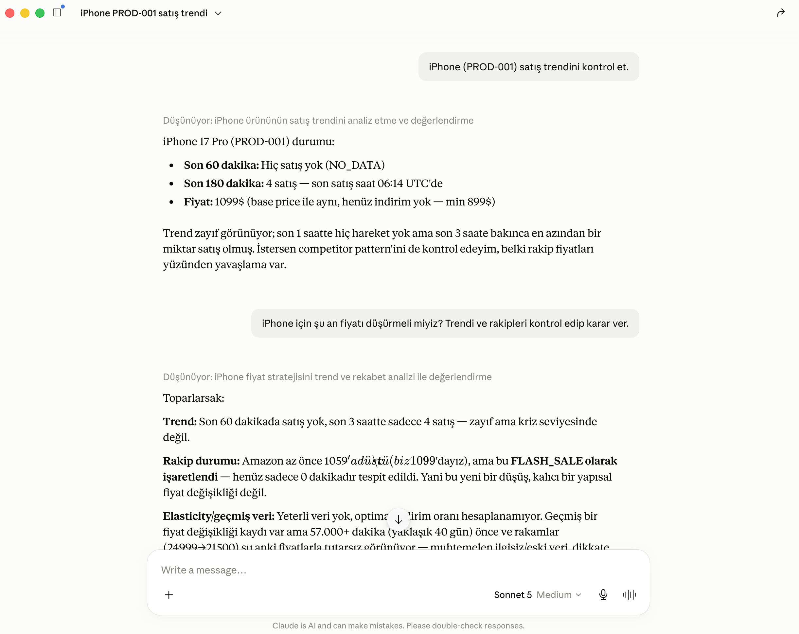

# Heweso — Autonomous Competitive Pricing Agent


An always-on AI agent that prices e-commerce products autonomously: it **observes** sales
and competitor data, **reasons** about what to do, **acts** (changes prices, emails, escalates),
then **evaluates the outcome and learns** from it. Built for a fictional Turkish e-commerce
platform ("Heweso") as a portfolio piece in agentic data engineering.

> **One sentence:** When a phone starts selling fast, the agent automatically discounts its
> accessories; when sales stall, it checks competitors, learns from history, and either drops
> the price or escalates to a human.

This is **not** a traditional ETL pipeline. A traditional pipeline moves data. This one closes
the loop: *sense → reason → act → evaluate → learn.* That loop is what makes it "agentic."

<p align="center">
  
  <br>
  <em>The ReAct loop running live: the agent senses the trend, checks the competitor pattern and
  price elasticity, decides <code>NO_ACTION</code> (already competitive), logs it, and stops — autonomously.</em>
</p>

<p align="center">
  <a href="#architecture">Architecture</a> ·
  <a href="#key-engineering-decisions">Key decisions</a> ·
  <a href="#lessons-learned-war-stories">Lessons learned</a> ·
  <a href="#the-learning-layer">Learning layer</a> ·
  <a href="#data-layer-medallion--dbt">Data layer</a> ·
  <a href="#reporting--interfaces">Reporting</a> ·
  <a href="#roadmap--future-improvements">Roadmap</a>
</p>

---

## Architecture

```
EventBridge (schedule, cost-guarded)
        │
        ▼
AWS Lambda (Python 3.12)  ──►  Amazon Bedrock (Nova Lite)
        │                       ReAct loop · 14 tools
        │
        ▼
┌───────────────────────────────────────────────┐
│ 14 TOOLS                                       │
│  SENSE   check_sales_trend · query_sales ·     │
│          check_competitors · get_time_context ·│
│          check_competitor_pattern             │
│  DECIDE  decide_price · analyze_price_elasticity│
│          check_outcome · check_bundle_trigger  │
│  ACT     update_price · log_action ·           │
│          send_email · escalate                 │
│  ANALYZE run_analytics                          │
└───────────────────────────────────────────────┘
        │                         │
        ▼                         ▼
   DynamoDB (4 tables)        Amazon SES
        │
        ▼
   S3 data lake  ──►  Athena / Glue  (Medallion: Bronze → Silver → Gold)
```

### The five subsystems

| # | Subsystem | What it does | Status |
|---|-----------|--------------|--------|
| 1 | **Live pricing agent** | Bedrock Nova Lite, ReAct loop, 14 tools | Deployed on Lambda |
| 2 | **Medallion pipeline** | DynamoDB → S3 Bronze/Silver/Gold, hourly, inside the Lambda | Automated |
| 3 | **dbt project** | SQL rebuild of Silver/Gold in an isolated schema, with data-quality tests | Manual (`dbt run && dbt test`) |
| 4 | **Weekly analytics report** | Reads Gold, builds an HTML report, AI writes the narrative, SES emails it | Built · tested locally |
| 5 | **MCP server** | Exposes all 14 tools over Model Context Protocol for any MCP client | Local dev tool |

The agent's decision-making brain (subsystem 1) was built first; 2–5 are the data-engineering
and tooling layer built *around* it.

<details>
<summary><b>Live on AWS</b> — console screenshots (click to expand)</summary>
<br>
<p align="center">
  <br>
  <em>Lambda <code>heweso-pricing-agent</code> — the deployed ReAct agent (EventBridge trigger, handler code).</em>
</p>
<p align="center">
  <br>
  <em>The every-minute EventBridge trigger — kept <b>Disabled</b> by default (the cost guard from the war story above).</em>
</p>
<p align="center">
  <br>
  <em>The 4 DynamoDB source tables — products, sales, competitor-prices, audit-log.</em>
</p>
</details>

---

## Tech stack

| Layer | Tools |
|-------|-------|
| Compute | AWS Lambda (Python 3.12) |
| AI / Agent | Amazon Bedrock (Nova Lite), ReAct pattern, Model Context Protocol (MCP) |
| Orchestration | Amazon EventBridge |
| Transactional store | Amazon DynamoDB (4 tables) |
| Analytics | Amazon S3 (data lake) · Athena · AWS Glue Data Catalog |
| Transformation | Python (Medallion) + dbt (SQL, parallel implementation, tested) |
| Notifications | Amazon SES |
| Frontend | FastAPI · Server-Sent Events · vanilla-JS dashboard |
| Methods | Epsilon-greedy (multi-armed bandit), Hive partitioning, data-quality gates |

---

## Key engineering decisions

### Math lives in code, not in the model — the AI orchestrates, the code computes
Nova Lite makes arithmetic mistakes on simple comparisons, so it is never trusted to *do*
anything exact. Every price calculation runs in Python (`decide_price`); the model's job is to
decide *which* tool to call and in what order, then follow the result. This is the core split:
the LLM handles judgment and orchestration, deterministic code handles anything that must be correct.

### One agent + 14 tools, not a multi-agent swarm
Pricing one product is a single coherent loop — sense → reason → act → evaluate — so it runs as
**one ReAct agent with 14 tools**, not an orchestrator delegating to specialist sub-agents.
Multi-agent designs carry real cost: extra LLM round-trips, inter-agent coordination, more failure
modes, and a harder-to-follow decision trace. None of that is justified at this scale, and a single
agent keeps the reasoning linear and auditable. Knowing when *not* to reach for multi-agent is part
of the design — the tools give specialization without the coordination tax.

### Guardrails, not just prompts
With an unreliable model, "the prompt says so" is never enough for anything touching money, data, or
outbound comms. Critical rules are enforced in code: a price guard forces `update_price` to use
`decide_price`'s value; a bundle guard injects the chosen discount even if the model forgets it;
`send_email` always sends to the verified address (no caller can choose the recipient);
`run_analytics` accepts read-only `SELECT`/`WITH` only; `update_price` clamps to `[min_price, base_price]`.

### Event-date vs snapshot-date partitioning
Bronze is a full DynamoDB scan, so each day's partition holds *all history up to that day*, and
aggregating Gold by the partition date double-counted across days. Gold now groups and partitions by
each row's **real event date** (`sale_date`/`action_date`, derived in Silver) — so each Gold row is
genuinely that day's activity, and the weekly report can read Gold directly.

### Structured fields over text parsing
The bundle discount rate used to be regex'd out of a free-text `reason` string. It's now a typed
`bundle_discount_pct` audit field written at the source (injected by the bundle guard, not trusted to
the model), flowing Bronze → Silver → Glue — so the learner reads a real column instead of parsing prose.

### dbt tests: singular over `dbt_utils`, deliberately
Composite `(date, product_id)` uniqueness needs a multi-column test. Rather than add the `dbt_utils`
dependency, the project uses hand-written **singular tests** — zero dependency, any dbt version.
That's a scale judgment (YAGNI at 3 Gold tables); at ~15–20+ tables I'd switch to
`dbt_utils.unique_combination_of_columns`. Knowing *when* to use each is the point.

### Data-driven, not rule-based
`get_time_context` used to return labels like `PEAK`/`HOLD` (hard rules). It now returns a raw
`traffic_ratio` and lets the model reason. That shift — from fixed rules to signals the model weighs
— is the essence of an agentic system.

---

## Lessons learned (war stories)

Two incidents taught me more than the happy path did.

### A schedule left "just enabled" quietly burned ~$19 in 26 hours
An EventBridge rule firing every minute kept triggering the full Bedrock agent for all four products
even when there were no sales to react to — and three analytics tools queried Athena with *no
partition filter*, so each call enumerated a 182-day partition-projection range: ~1.3M redundant S3
`LIST` requests in total. I traced it in Cost Explorer (token + request breakdown), then fixed it on
two levels — an **operational** guard (the minute-rule stays disabled by default, documented so it's
never left on) and a **code** fix (every Athena query is now partition-scoped, `WHERE date = today`).

*Lesson: in serverless, an idle trigger is a silent money leak, and every warehouse query must be partition-scoped.*

### `update_item` is an upsert — a stale test fixture silently corrupted the data
A demo helper set `undercut_since` on a competitor named "Trendyol" that no longer existed after the
catalog changed (competitors are now Amazon / Best Buy / MediaMarkt). Because DynamoDB's
`update_item` *creates* a row when the key is absent, it wrote a **phantom competitor row with no
`price` field** — and the read tools crashed with `KeyError('price')`. I fixed the **root cause**
(point the fixture at a real competitor) and hardened the **class of failure** (the read tools now
skip rows with no usable price, so one malformed record can't take down the whole competitor check).

*Lesson: NoSQL "update-that-inserts" plus a stale fixture is a subtle corruption vector — always parse stored/external data defensively.*

---

## The learning layer

- **Price elasticity** (`analyze_price_elasticity`): for each past discount, sums the **revenue**
  (not unit count) in the following 60 minutes, grouped by discount %, with confidence scoring
  based on sample size. Low confidence → ignore and just match the competitor.
- **Bundle pricing via epsilon-greedy** (`check_bundle_trigger`): a multi-armed bandit over
  discount rates `[5, 7, 9, 11]%`. 70% exploit the best-known rate, 30% explore — with a
  **confidence gate** so a lucky single sample can't be crowned "best."
- **Flash-sale vs structural** (`check_competitor_pattern`): a competitor cheaper for <60 min is a
  flash sale (wait); >180 min is structural (match). Detected via an `undercut_since` timestamp.

---

## Data layer (Medallion + dbt)

```
Bronze  raw DynamoDB export, never mutated
Silver  cleaned, joined, derived fields, data-quality gate (drops invalid product_ids)
Gold    pre-aggregated business metrics, partitioned by event date
```

Two parallel implementations of Silver/Gold exist on purpose: a **Python** pipeline (the live one,
runs hourly inside the Lambda) and a **dbt** project (SQL, in an isolated Glue schema, with 18
automated data-quality tests: `unique`, `not_null`, `relationships`, `accepted_values`, plus
custom singular composite-key tests). The dbt version demonstrates the same transformations with
an industry-standard tool and never collides with the live tables.

<p align="center">
  <br>
  <em>The Gold layer queried in Athena — pre-aggregated daily metrics per product, partitioned by event date.</em>
</p>

<p align="center">
  <br>
  <em><code>dbt test</code> — 18/18 data-quality tests passing (<code>unique</code>, <code>not_null</code>,
  <code>relationships</code>, <code>accepted_values</code> + custom composite-key tests).</em>
</p>

---

## Reporting & interfaces

### Weekly analytics report — a mini analytics pipeline, with an AI analyst on top
`lambda/analytics_handler.py` is a small pipeline in its own right: SQL/Python aggregates every
metric off the **Gold** layer — total sales, revenue, price actions, and bundle effectiveness per
product — and hands those finished numbers to a **single Bedrock call** that writes the plain-English
**Insight** paragraph (the yellow box below). That call *narrates, it never calculates*: it only ever
sees the computed stats, never raw rows, so it physically cannot invent or misstate a figure. It's the
same "math out of the model" discipline as the pricing path, applied to reporting — the numbers are
deterministic; the AI adds the *analysis* ("Samsung dominated; no escalations may have kept sales
steady; the cheaper audio products underperformed — consider promotions"). SES delivers it as HTML.

<p align="center">
  <br>
  <em>The auto-generated weekly report. Every number is computed in SQL/Python; the yellow <b>Insight</b>
  paragraph is the AI analyst narrating those finished stats — it never recomputes them.</em>
</p>

### MCP server — the same 14 tools, in any AI client
`mcp_server/server.py` exposes all 14 tools over the Model Context Protocol, so any MCP client
(Claude Desktop, Claude Code) can drive the pricing tools in natural language — a parallel access
layer that reuses the exact same tool code as the Bedrock agent, without touching it.

<p align="center">
  <br>
  <em>Claude driving the pricing tools over MCP in natural language — it chains the sales-trend,
  competitor, and flash-vs-structural checks, then reasons to a hold-vs-drop recommendation.</em>
</p>

---

## Known limitations & tradeoffs

Honesty about a system's weak points is part of understanding it.

- **Full-scan Bronze, not incremental/CDC.** A deliberate simplicity tradeoff for this data volume.
  The production-correct version (DynamoDB Streams / watermarked incremental ingestion) is the
  planned pre-open-source upgrade.
- **Elasticity is observational, not a true A/B test.** No control group, so correlation isn't
  cleanly causation. A real experiment (or the bandit approach used for bundles) would be stronger.
- **Confidence scoring uses fixed sample-count thresholds**, not a full statistical test. A pragmatic
  shortcut; the rigorous version computes a standard error / confidence interval per discount rate.
- **Nova Lite** intermittently throws `ModelErrorException` (~20% of runs) and occasionally forgets
  tool parameters — the guardrails absorb this, and the agent retries on the next trigger.
- **Market simulation uses random competitor prices**, not real scraping (the biggest gap between
  demo and product).

---

## Repository structure

```
├── agent/            system_prompt.py · bedrock_agent.py (ReAct loop + guards) · report_agent.py
├── tools/            the 14 tools (flat, each independently testable), grouped by role:
│      SENSE     check_sales_trend · query_sales · check_competitors · check_competitor_pattern · get_time_context
│      DECIDE    decide_price · analyze_price_elasticity · check_outcome · check_bundle_trigger
│      ACT       update_price · log_action · send_email · escalate
│      ANALYZE   run_analytics
├── infrastructure/   dynamodb_setup.py · export_to_s3.py · medallion/{silver,gold,setup_glue_tables}.py
├── dbt_heweso/       dbt project (models/silver, models/gold, tests/) — SQL Medallion + tests
├── lambda/           handler.py (agent + hourly pipeline) · analytics_handler.py (weekly report)
├── mcp_server/       server.py — 14 tools exposed over MCP
├── frontend/         FastAPI dashboard (SSE, live sales, agent terminal)
└── assets/           screenshots used in this README
```

---

## Running locally

```bash
# 1. Configure credentials (never committed)
cp .env.example .env    # fill in AWS + SES values

# 2. Seed a clean dataset
python3 -c "from infrastructure.dynamodb_setup import seed_all; seed_all(crisis_mode=False)"

# 3. Refresh the data lake (Bronze → Silver → Gold)
python3 infrastructure/export_to_s3.py
python3 infrastructure/medallion/silver.py
python3 infrastructure/medallion/gold.py

# 4. (optional) Run the dbt layer
cd dbt_heweso && dbt run && dbt test

# 5. Start the dashboard
uvicorn frontend.api:app --port 8000 --reload   # → http://localhost:8000
```

---

## Roadmap / Future improvements

Deliberately scoped out of the current build — each is a conscious "not yet at this scale"
decision, not an oversight:

- **Incremental / CDC ingestion for Bronze.** Today the pipeline does a full DynamoDB scan every
  hour, so each partition holds *all history up to that day*. The production-correct version is
  change-data-capture on the **event** tables (`sales`, `audit`) — via DynamoDB Streams or a
  timestamp watermark — so each partition holds only that day's real events and ingestion cost
  stays flat as data grows. The **state** tables (`products`, `competitors`) stay as snapshots,
  since you always want their latest full state. (The event-date Gold aggregation already makes
  the *data* correct; CDC removes the root cause and the full-scan cost.)
- **Deploy the weekly analytics reporter** to its own Lambda + weekly EventBridge rule (code is
  ready and tested locally; stays fully AWS-native).
- **Real competitor scraping** (Apify / SerpAPI) instead of simulated prices — the biggest gap
  between demo and product.
- **Model comparison** — run the same scenarios on Nova Lite vs Claude Haiku and compare accuracy
  against cost.
- **Automate dbt** via a container-image Lambda + EventBridge (currently run manually).

---

*Built as an internship / portfolio project to demonstrate agentic data engineering on AWS.*
